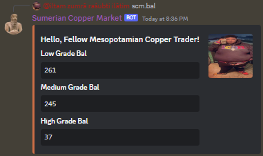
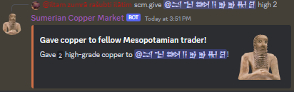
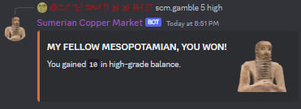
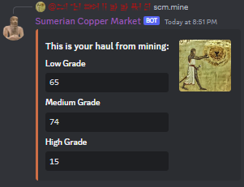
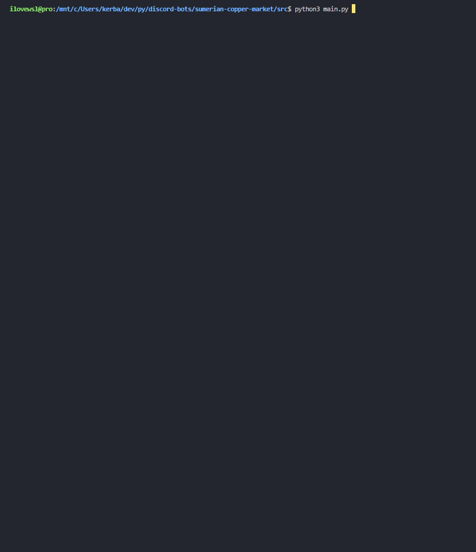

# sumerian copper market bot

```
Wrapper.: dpy 2.0
Py Ver..: 3.10
Database: sqlite3 (sqlalchemy)
```

Hastily put this bot together because I enjoy bronze age shitpost. \
This is my first time using an actual database for a d-bot. (sqlite3)

I usually use JSON to store my data, but today I've decided to not be a dumbass and actually focus on improving my code. \
I also learned a lot about OOP, test-driven development, and GitHub Actions.

The OOP part is mainly in `src/econ_types/trader.py` \
The TTD portion is obviously in `src/tests`, \
The GH Actions are in the `actions` tab in the repo.

I'm not sure what else to add to the bot.

(The cog loader is focused on *NIX. Backslashes in paths are so stupid. Kiss my ass Bill Gates.)

## Commands:
**Client Tools**
> `help` : shows this \
> `latency` : shows the latency in ms

**Market Tools**
> `create` : Become a trader \
> `bal` : Shows your balance \
> `mine` : Go to the mines \
> `beg` : No one likes a begger \
> `gamble` : Gamble away your copper \
> `give` : Give money to someone \
> `ask` : Ask Ea-Nasir something

**Market Mod Tools**
> `reset` : Reset a user's balance \
> `delete` : Delete a user

## Images:
<details style="cursor: pointer;">
    <summary>Some Commands</summary>
    <br/>
    <br/>
    <br/>
    <br/>
</details>

<details style="cursor: pointer;">
    <summary>Unit tests before client start</summary>
    
</details>


## License

MIT License \
Copyright (c) 2023 QAEZZ